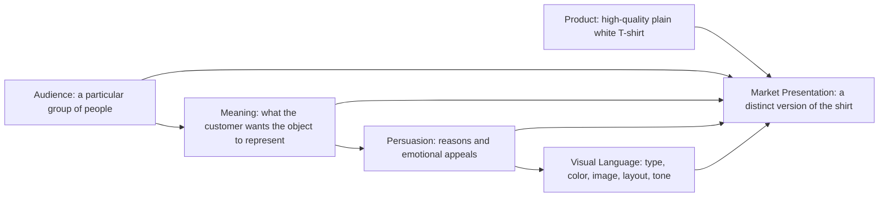

# The Same Shirt, Four Different Lives

A plain white T-shirt looks like the easiest product in the world to sell. It has no logo shouting for attention, no special pattern, and no complicated feature list. That is exactly why it is useful for studying persuasion.

The shirt stays substantially the same in every version: a high-quality, ordinary white T-shirt with a comfortable fit, durable construction, and no visible branding. What changes is the story placed around it. The product is physical; the presentation gives it a job in the customer's imagination.

Think of this as a casting exercise. The shirt is one actor. In each campaign, it walks onto a different stage, speaks in a different voice, and attracts a different audience.

## Concept 1: The Open Road Shirt

**Audience:** People who enjoy travel, day trips, hiking, and making plans at the last minute. They want clothing that feels ready for whatever happens next.

**Chosen brand archetype:** Explorer

**Persuasion principles being used:**

- **Aspiration:** The product is connected to a freer, more adventurous version of the customer's life.
- **Association:** Images of movement and unfamiliar places make the shirt feel capable, even though its physical features remain ordinary.
- **Clarity:** A short, confident promise makes the choice easy: one dependable shirt, many possible days.
- **Identity appeal:** Buying the shirt becomes a small declaration that the customer is the kind of person who goes.

**Visual-design language:** Sunlit documentary photography, imperfect maps, handwritten route notes, wide margins, and practical captions. The layout feels collected from a backpack rather than polished in a boardroom. Colors stay close to white, faded blue, charcoal, and road-dust red so the shirt remains visible without making the campaign feel luxurious.

**Headline:** *Leave Room for the Unexpected.*

**Short product story:** The shirt is packed before the destination is chosen. It works under a jacket on a cool morning, by itself during a long walk, and at a small roadside restaurant where the day has unexpectedly ended. Its value is not that it promises an epic adventure; it is that it does not demand one.

**Imagery direction:** A folded shirt beside a half-zipped bag; the shirt on a person standing at a train platform; close-ups of fabric catching wind; a sequence of ordinary travel moments rather than staged mountain-top triumphs. Show the wearer moving through the world, not pretending to conquer it.

**Meaning the customer is invited to buy:** The customer is buying readiness and possibility. The shirt says, “My life can remain open.”

**Ethical concern or possible misuse:** Adventure imagery can exaggerate what the garment can do. A comfortable T-shirt is not automatically technical outdoor equipment. The campaign should avoid implying protection from weather, exceptional performance, or access to an adventurous lifestyle that the product cannot provide.

## Concept 2: The Grid Shirt

**Audience:** Designers, engineers, students, and other people who like useful objects, calm spaces, and decisions without unnecessary drama.

**Chosen brand archetype:** Everyperson, expressed through practical reliability

**Persuasion principles being used:**

- **Simplicity:** Fewer claims and fewer visual distractions make the product feel easy to understand.
- **Trust through consistency:** Repeated measurements, careful descriptions, and straightforward language suggest dependability.
- **Reduction of choice overload:** The campaign treats one good option as a relief from endless comparison.
- **Social proof:** Small customer notes about repeat wear can support the idea of reliable everyday use, as long as they are real and documented.

**Visual-design language:** Restrained modernist and Swiss-influenced design: a strict grid, sans-serif typography, strong alignment, generous white space, limited color, and information arranged with almost architectural precision. Product details are labeled rather than decorated. A small red square may act as an accent, but it never competes with the shirt.

**Headline:** *One Clear Choice.*

**Short product story:** The shirt is presented as an object that does its work quietly. It fits into a weekday, a weekend, a layered outfit, and a laundry routine without asking the customer to perform a personality. The campaign does not turn “basic” into an insult. It treats basic as a useful achievement.

**Imagery direction:** Front, back, and side views on a neutral field; a neatly folded shirt shown beside a simple measurement diagram; a sequence of the same shirt styled three ordinary ways. Use even lighting and honest scale. The camera should behave like a careful instrument.

**Meaning the customer is invited to buy:** The customer is buying control, calm, and competence. The shirt becomes evidence that a well-made everyday decision can remove friction from life.

**Ethical concern or possible misuse:** Minimalism can make marketing claims look more objective than they are. A clean grid and precise typography do not prove superior quality. The campaign must clearly separate measured facts, such as available sizes or material composition, from aesthetic suggestions about order and intelligence.

## Concept 3: The Wrong Shirt for the Right People

**Audience:** Young creatives, club-goers, and people who enjoy irony, remixing conventions, and making ordinary objects feel strange again.

**Chosen brand archetype:** Outlaw

**Persuasion principles being used:**

- **Pattern interruption:** Unexpected images and deliberately awkward copy earn attention by refusing the usual clothing-ad format.
- **Humor:** A joke lowers the distance between the brand and the audience.
- **Reactance:** The campaign lightly challenges polished fashion expectations, making the customer want to reject them.
- **In-group signaling:** Understanding the campaign's strange tone becomes a way to recognize people with similar tastes.

**Visual-design language:** Disruptive postmodern collage: clashing type sizes, stickers, photocopy textures, cut-up product images, abrupt color blocks, and captions that contradict the image. A formal product photograph might be interrupted by a giant “BORING?” or placed next to an image of a completely unrelated object. The visual system is intentionally unstable, but the shirt must still be easy to inspect.

**Headline:** *This Is Not a Personality.*

**Short product story:** The campaign refuses to claim that a T-shirt can transform anyone into a rebel. Instead, it makes fun of that promise. The shirt is plain, comfortable, and useful; the customer supplies the chaos. Wearing it becomes a choice to use an ordinary starting point in an unordinary way.

**Imagery direction:** The shirt pinned to a wall under an absurd handwritten note; a model wearing it beneath an elaborate costume; an over-serious studio photograph interrupted by doodles and redaction bars; a short video in which the shirt is repeatedly styled in ways the advertisement pretends not to understand.

**Meaning the customer is invited to buy:** The customer is buying permission to play with meaning. The shirt is a blank surface, but the real product is the feeling of being in on the joke.

**Ethical concern or possible misuse:** Irony can become an excuse for unclear information or exclusion. A campaign that mocks its own claims may still hide price, fit, labor, or material details. It should not use shock, ridicule, or insider language to make customers feel foolish for asking basic questions.

## Concept 4: The White Shirt, Shared

**Audience:** People who value repair, thoughtful consumption, and local or community-centered projects. They want purchases to fit their values without being lectured.

**Chosen brand archetype:** Caregiver

**Persuasion principles being used:**

- **Reciprocity:** The presentation connects the purchase to useful care, such as repair guidance or a take-back option, only when those actions genuinely exist.
- **Moral identity:** The customer can see the purchase as consistent with being responsible and considerate.
- **Concrete commitment:** A clear care instruction is more persuasive than a vague promise to “do better.”
- **Narrative transportation:** A small story about keeping and caring for an object makes long-term use feel meaningful.

**Visual-design language:** Warm editorial photography, soft natural light, close views of hands and fabric, modest typography, and calm colors. The design feels like a well-used notebook or a neighborhood workshop: human, tactile, and unhurried. It avoids the visual language of purity, because a white shirt is not evidence of moral purity.

**Headline:** *Keep It in the Story.*

**Short product story:** The shirt begins as an everyday purchase and becomes part of a personal archive: a first day at a new job, a shared trip, a repaired cuff, a favorite season. The campaign invites customers to wash it carefully, mend it when useful, and decide honestly when it is no longer wearable.

**Imagery direction:** A shirt drying on a line, a small repair in progress, a drawer with visible signs of use, and portraits of different people wearing the same garment over time. Show wear as information rather than failure. Avoid pretending that one purchase solves a large environmental or labor problem.

**Meaning the customer is invited to buy:** The customer is buying continuity and care. The shirt becomes a participant in a longer life rather than a disposable signal of virtue.

**Ethical concern or possible misuse:** Values-based branding can turn responsibility into a sales costume. The campaign must not imply that buying this shirt makes someone a better person, or use vague sustainability language without evidence. It should also acknowledge that care, repair, and responsible disposal require time and resources that are not equally available to everyone.

## Synthesis Table

| Concept | Audience | Archetype | Persuasion emphasis | Visual language | Meaning being sold |
| --- | --- | --- | --- | --- | --- |
| The Open Road Shirt | Travelers and spontaneous planners | Explorer | Aspiration, association, identity | Documentary travel, maps, movement | Readiness and possibility |
| The Grid Shirt | Practical, design-minded everyday users | Everyperson | Simplicity, consistency, reduced choice | Restrained modernist / Swiss-influenced grid | Calm control and competence |
| The Wrong Shirt for the Right People | Creative rule-breakers | Outlaw | Pattern interruption, humor, in-group signaling | Disruptive postmodern collage | Permission to play |
| The White Shirt, Shared | Care- and repair-minded customers | Caregiver | Reciprocity, moral identity, concrete commitment | Warm editorial, tactile, human | Continuity and care |

The table shows why “the product” is never only the object. The shirt's material reality matters, but each presentation selects a different emotional job for it. One shirt helps a person imagine leaving. Another helps them simplify. A third lets them joke about branding. The fourth makes ordinary use feel worth preserving.

## How the Pieces Combine

A market presentation is built by connecting the physical product to a particular audience, a desired meaning, a persuasive strategy, and a visual language. Change one part and the presentation shifts; change several parts and the same shirt can seem to belong to a completely different world.

The arrows are not a formula for manipulating people. They are a checklist for noticing choices. Before believing an advertisement, ask: Who is this for? What identity or feeling is it offering? Which facts support the promise? Which visual choices make the promise seem natural? Those questions help separate a useful presentation from a misleading one.

## What You Should Remember

- The physical product can stay nearly the same while its market meaning changes dramatically.
- Audience, archetype, persuasion, and visual language work together; none of them operates in isolation.
- An Explorer can make a T-shirt feel like readiness, a modernist system can make it feel like order, an Outlaw campaign can make it feel playful, and a Caregiver campaign can make it feel enduring.
- Visual style does not prove a product claim. Design creates expectations, so claims still need to be truthful.
- The most persuasive presentation is not automatically the most ethical one. Ask what the customer is really being invited to buy.
